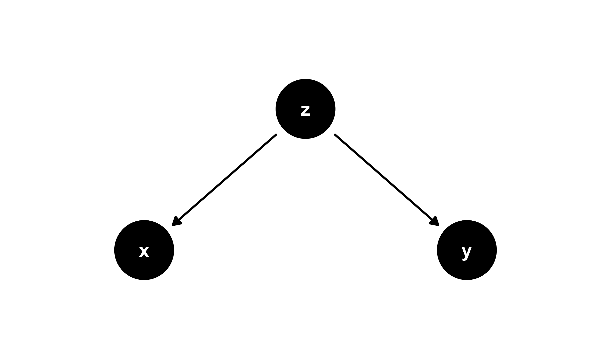

<!-- README.md is generated from README.Rmd. Please edit that file -->

# Example Code for a Monte Carlo Simulation Study

Code in R and Stata to code, run, and analyse a simulation study is
included in this repository. The specific simulation study is described
down below.

## Structure of this repository

This repository is organised as follows:

-   R code is included in the folder named `R`, with three scripts: one
    for coding the simulation study, one for analysing the results, and
    one for creating plots and tables with the results;

-   Stata code is included in the folder named `Stata`, including three
    analogous scripts.

-   Simulated data with the results obtained by the above-mentioned code
    in R and Stata are included in the folder named `data`. The R
    dataset has extension `*.RDS`, while the Stata dataset has extension
    `*.DTA`.

## Aims of the simulation study

The aim of this simulation study is pedagogical.

Say we have a study which can be summarised by the following DAG:

``` r
library(ggdag)
#> Loading required package: ggplot2
#> 
#> Attaching package: 'ggdag'
#> The following object is masked from 'package:stats':
#> 
#>     filter

confounder_triangle() %>%
  ggdag() +
  theme_dag_blank(base_size = 12)
```



where X is the exposure, Y the outcome, and Z a confounder.

> Note that the exposure and the outcome are independent, there is no
> edge between X and Y.

We know that there should be no observed association between X and Y
once we adjust for Z in our analysis.

However:

1.  Is it true that once we adjust for Z we observe no association
    between X and Y?

2.  What happens if we fail to adjust for a confounder in our analysis?

This is what we are trying to learn from this simulation study.

## Data-generating mechanisms

X is a binary treatment variable, Z is a continuous confounder, and Y is
a continuous outcome.

Z is simulated from a standard normal distribution, while X depends on Z
according to a logistic model:

``` tex
\log \frac{P(X = 1)}{P(X = 0)} = \gamma_0 + \gamma_1 Z
```

Y depends on Z according to a linear model:

``` tex
Y = \alpha_0 + \alpha_1 Z + \varepsilon
```

with `\varepsilon` following a standard normal distribution.

We fix the parameters `\gamma_0 = 1`, `\gamma_1 = 3`, `\alpha_0 = 10`.
For `\alpha_1`, we actually simulate two scenarios:

1.  `\alpha_1 = 5`: in this scenario, Z is actually a confounder;

2.  `\alpha_1 = 0`: in the second scenario, we remove the edge between Z
    and Y. Here Z is not a counfounder anymore.

Finally, we generate N = 200 independent subjects per each simulated
dataset.

## Estimand

We have a single estimand of interest here, the regression coefficient
that quantifies the association between X and Y.

> Remember that, according to our data-generating mechanisms, we expect
> *no* association between X and Y.

## Methods

We estimate the regression coefficient of interest using linear
regression. Specifically, we fit the following two models:

1.  A model that adjusts for the observed confounder Z (model 1):

``` tex
Y = \beta_0 + \beta_1 X + \beta_2 Z + \varepsilon
```

1.  A model that does not (model 2):

``` tex
Y = \beta_0 + \beta_1 X + \varepsilon
```

The coefficient of interest is *β*<sub>1</sub> according to this
notation.

## Performance measures

The key performance measure of interest is bias, defined as

``` tex
E(\hat{\beta_1})
```

as we know that — according to our DGMs — the true `\beta_1 = 0`.

We might also be interested in estimating the power of a significance
test for `\hat{\beta_1}` at the `\alpha = 0.05` level. In our example,
think of that as a test for the null hypothesis `\beta_1 = 0`.

# License

<a rel="license" href="http://creativecommons.org/licenses/by/4.0/">

</a> <br /> This work is licensed under a
<a rel="license" href="http://creativecommons.org/licenses/by/4.0/">Creative
Commons Attribution 4.0 International License</a>.
